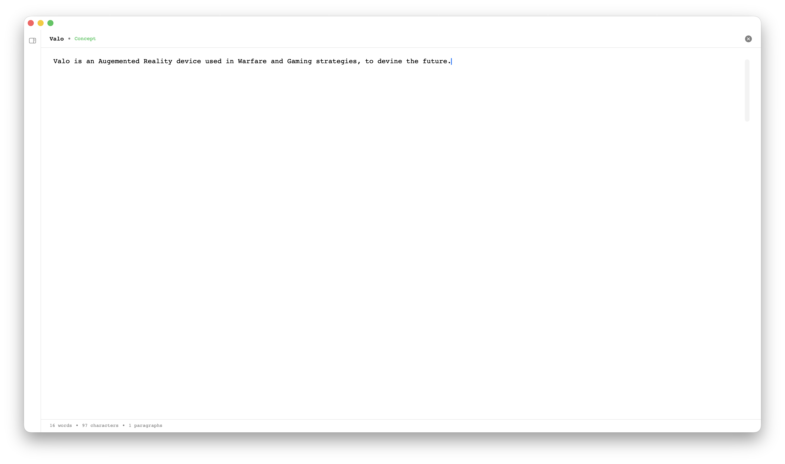
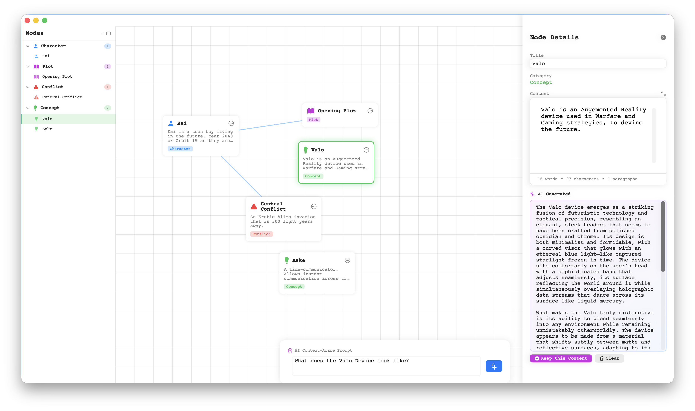

# Odyssey

A beautiful macOS SwiftUI writing app designed for novel writing. Odyssey combines node-based organization with AI-powered content generation to help you visualize and develop your novel ideas in a whole new way.

## Screenshots




## Features

✨ **What makes Odyssey special:**

- **Visual Node Canvas**: Organize your novel's characters, plots, conflicts, and concepts in an intuitive visual workspace
- **Context-Aware AI Prompts**: AI that understands your novel's relationships and generates content based on selected nodes and their connections
- **Dual AI Support**: Works with both Ollama (local) and Mistral AI (cloud) - choose what works best for you
- **Beautiful Typography**: Courier font with 1.2 line spacing and 1.5 margins, optimized for novel writing
- **Interactive Linking**: Build connections between story elements to create rich, interconnected narratives for your novel
- **Save Your Projects**: Save your book projects as `.book` files to preserve your work and continue later

## Requirements

- macOS 13.0 or later
- Swift 5.9 or later
- Ollama (for local AI) - [Install Ollama](https://ollama.ai)
- Mistral AI API Key (optional, for cloud AI) - Set via `MISTRAL_API_KEY` environment variable

## Building

Build the app using Swift Package Manager:

```bash
swift build -c release
```

Run the app:

```bash
swift run
```

Or build and run in one command:

```bash
swift run Odyssey
```

## Usage

Start organizing and writing your novel:

1. **Add Nodes**: Use the menu bar to add nodes of different categories (Character, Plot, Conflict, Concept) to build your novel's structure
2. **Link Nodes**: Long-press on a node to start linking, then tap another node to create a connection
3. **Select Nodes**: Click on a node to view and edit its details in the sidebar
4. **Generate Content**: Select a node, enter a prompt in the central input, and generate AI content for your novel based on the node's context and relationships
5. **Pan Canvas**: Click and drag on the background to pan the canvas
6. **Save Your Work**: Save your book project as a `.book` file to preserve all your nodes, links, and content for future sessions

## AI Configuration

### Ollama (Local)

1. Install Ollama from [ollama.ai](https://ollama.ai)
2. Pull a model: `ollama pull mistral` or `ollama pull llama2`
3. Select "Ollama" in the app and enter the model name

### Mistral AI (Cloud)

1. Get an API key from [mistral.ai](https://mistral.ai)
2. Set the environment variable: `export MISTRAL_API_KEY=your_key_here`
3. Select "Mistral AI" in the app

## Project Structure

```
Odyssey/
├── Sources/
│   ├── OdysseyApp.swift          # App entry point
│   ├── Models/
│   │   └── Node.swift            # Node data model
│   ├── ViewModels/
│   │   └── NodeCanvasViewModel.swift  # Canvas state management
│   ├── Views/
│   │   ├── ContentView.swift     # Main view
│   │   ├── NodeCanvasView.swift  # Canvas rendering
│   │   ├── NodeView.swift        # Individual node view
│   │   ├── PromptInputView.swift # AI prompt input
│   │   ├── NodeDetailSidebar.swift # Node details panel
│   │   └── MenuBarView.swift     # Top menu bar
│   └── Services/
│       └── AIService.swift       # AI integration
└── Package.swift
```

## License

This project is open source and available for personal use.


