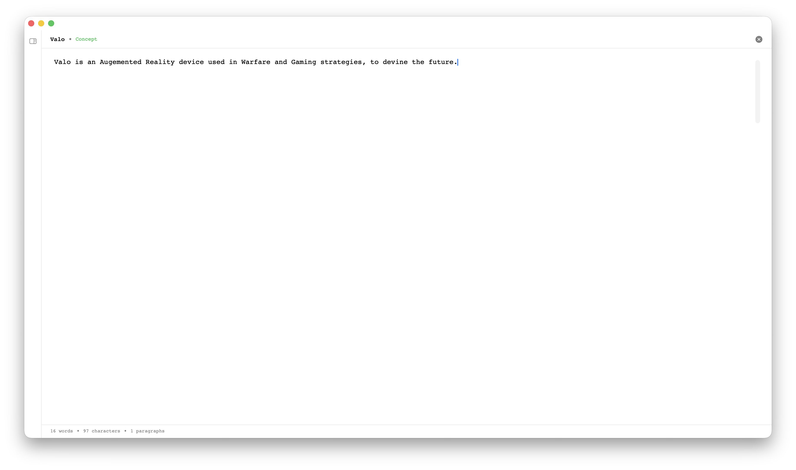
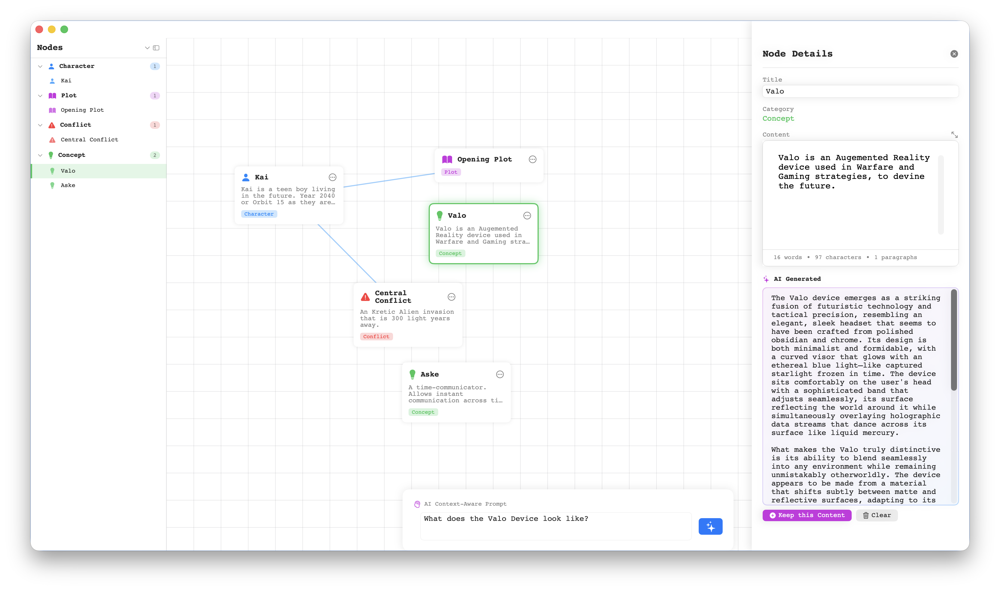

# Odyssey

Odyssey is a macOS SwiftUI writing studio for novels and long-form fiction. It combines a visual story canvas, focused writing surfaces, structured node templates, and AI-assisted generation so writers can build worlds, characters, scenes, and story logic without losing momentum.

## Version

Current release: `v1.2.0`

## Screenshots




## Highlights

- Visual node canvas for planning characters, scenes, themes, conflicts, and story structure
- Category-specific templates for every node type, with tailored fields that feed directly into AI generation context
- Writing-focused workflow that lets you move between hierarchy selections and content mode without breaking focus
- Autosave and crash recovery for both saved books and untitled drafts
- Directional node linking with clearer source/target cues and arrowed relationship lines
- `.book` project saving for preserving node graphs, writing, templates, and AI output
- Support for local and remote AI providers: MLX, Ollama, OpenAI, and Mistral

## What Changed In v1.2.0

- Added structured templates for every node category
- Added recovery snapshots and restore flows so unsaved writing is protected
- Improved full-screen writing behavior and hierarchy-driven node switching
- Refined linking UX with directional arrows, source/target indicators, and clearer guidance
- Updated prompt/input positioning so the canvas stays balanced while sidebars open and close

## Requirements

- macOS 13.0 or later
- Swift 5.9 or later
- Optional local AI:
  - Ollama: [ollama.ai](https://ollama.ai)
  - MLX / MistyStudio running locally on `http://localhost:11973`
- Optional cloud AI:
  - OpenAI API key via `OPENAI_API_KEY`
  - Mistral API key via `MISTRAL_API_KEY`

## Building

Build the Swift package:

```bash
swift build -c release
```

Run the app directly from SwiftPM:

```bash
swift run Odyssey
```

Build a macOS app bundle:

```bash
./build_app_bundle.sh
```

## Usage

1. Add nodes for the parts of your story you want to develop.
2. Select a node to edit its title, writing content, and category template fields.
3. Use the node templates to provide structured details like character traits, prophecy data, scene goals, relationship tension, and more.
4. Generate AI content from the prompt bar. Odyssey includes the selected node, its template values, and linked-node context in the generation prompt.
5. Enter linking mode, choose a source node, preview the arrow to a target node, and click to create a relationship.
6. Use writing mode for focused drafting while keeping the hierarchy available for quick switching.
7. Save as a `.book` file, or rely on autosave and recovery to protect in-progress writing.

## Project Structure

```text
Odyssey/
├── Sources/
│   ├── OdysseyApp.swift
│   ├── Models/
│   │   ├── Book.swift
│   │   ├── Node.swift
│   │   └── NodeTemplate.swift
│   ├── Services/
│   │   ├── AIService.swift
│   │   ├── BookService.swift
│   │   └── RecoveryService.swift
│   ├── ViewModels/
│   │   └── NodeCanvasViewModel.swift
│   └── Views/
│       ├── ContentView.swift
│       ├── NodeCanvasView.swift
│       ├── NodeDetailSidebar.swift
│       ├── NodeHierarchyView.swift
│       ├── NodeView.swift
│       ├── PromptInputView.swift
│       ├── RecoverySheet.swift
│       ├── WritingModeView.swift
│       └── WritingView.swift
├── Package.swift
├── build.sh
└── build_app_bundle.sh
```

## License

This project is open source and available for personal use.
